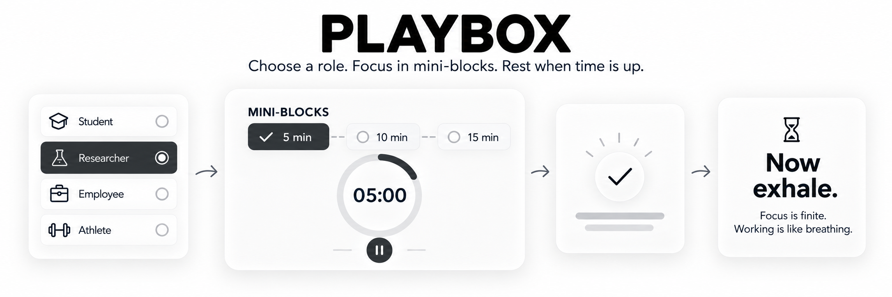

# Playbox



Playbox is a focus tool built around bounded engagement: one temporary
role, one task, a finite focus session, visible mini-timeboxing, a clear exit,
and a recovery period. It is for anyone who wants focused work to be easier to
enter, shape, and leave. Its low-friction, time-bounded approach may also appeal
to people looking for ADHD-friendly or neurodiversity-friendly focus tools.

**[Try the browser demo](https://greenw0126.github.io/Playbox/)** and experience
Playbox directly in your browser.

> Pick a role. Set the stage. Start the clock. Clear the quest. Bank the win.
> A game play with reality—giving real life a game-like structure.

## Why this?

**A role filters action:** For this session, your role defines what belongs.
When your mind drifts toward something unrelated, there is less to negotiate:
it is simply outside the role you chose for now—so no permission to act.

**An easy start lowers the threshold:** Every session begins with one
approachable five-minute mini-block. Offer yourself an easy start and see where
the work takes you. Five more minute? It's your call.

**A countdown creates momentum:** Mini-blocks turn open-ended work into a
short, visible deadline. Time keeps moving, giving your attention a reason to
stay with what you chose. Mini-blocks hold a time structure for you, so you don't
have to.

**Interruptions do not erase progress:** Pause when life gets in the way and
resume when you are ready.

**Committed work protects free time:** Do the work you chose inside a clear
boundary, then leave it there. A solid session makes the rest of the day feel
like your own—not time borrowed from unfinished work.

**Effort becomes evidence:** The Session Notebook records what you worked on
and where your time actually went. Over time, those patterns reveal what you
are making room for—and where your intentions and actions may differ. The work
is no longer a vague feeling; it is something real you can carry into guilt-free
rest.

**Rest has value of its own:** Exhale interrupts the impulse to begin another
round immediately. Recovery is not only preparation for more productivity.
When the work is done, it is done.

**A little play adds energy:** Roles and mini-blocks turn focus into a visible,
game-like rhythm. Moving between roles can make different kinds of work feel
distinct, deliberate, and more engaging.

Each visitor's history, recent tasks, active session, and language preference stay in your own
browser under separate `playbox.*` keys. Do login needed.

Playbox includes an in-page `EN / 中文` language setting. It defaults to
Mandarin when the browser language begins with `zh`; otherwise it starts in
English. The selection is remembered in that browser.

## 中文简介

Playbox 是一个用清晰边界组织专注的工具，面向任何希望更容易开始、持续与结束
一段行动的人。每次只选择一个临时角色、一项任务和一段有限时间，再用清晰可见
的 mini-block 把行动拆小；任务完成后，Playbox 会明确结束本轮，并进入 Exhale
恢复时间。其低门槛、短时段与可中断的设计，也适合正在寻找 ADHD 或
神经多样性友好专注方式的人。

**[打开浏览器演示](https://greenw0126.github.io/Playbox/)**，无需注册即可直接体验。

> 选个角色，布置场地，启动计时，完成任务，记下一局。然后退出游戏。
> 让无限的现实有明确的行动架构。

### 为什么这样设计？

- **角色过滤行动：** 当前角色决定什么属于这段时间；无关的念头可以先留在框外。
- **轻松开始：** 先从容易行动的 5 分钟开始。
- **倒计时创造动力：** mini-block 把开放式任务变成看得见的短期限，让注意力回到当下。
- **允许打断：** 现实介入时随时暂停，准备好再继续。
- **认真工作，安心生活：** 在约定的时间里完成扎实的一段，之后的休息便不再像从工作中借来的。
- **让投入留下证据：** Session Notebook 记录时间真正花在了哪里。长期积累的轨迹会呈现你在为什么留出空间，也能看见意图与行动之间的差距；做过的事清楚可见，休息也更安心。
- **休息本身就有价值：** Exhale 阻止立刻再开一局的冲动；工作结束了，就是结束了。
- **让专注更有趣：** 在角色与时间块之间切换，为不同任务带来清晰、轻盈的游戏节奏。

### 数据与隐私

演示版无需账户，也没有后端、分析工具或云同步。任务、历史记录、当前状态和
语言偏好只保存在你自己的浏览器中。页面支持 `EN / 中文`，并会记住你的选择。

### 本地运行

安装依赖后，运行 `npm run dev:public` 启动公开演示版。公开版本通过 GitHub Pages
发布，项目采用 [MIT License](LICENSE)。

## Try the public/demo version locally

```bash
npm install
npm run dev:public
```

The standard release build is also the public variant:

```bash
npm run build
npm run preview
```

## Checks

```bash
npm test
npm run build:public
```

## Privacy and data behavior

- There is no backend, account, analytics SDK, or cloud sync.
- Playbox stores each visitor's session state, notebook, recent tasks,
  and language preference in that browser's `localStorage`.
- Workspace reference images are static; Playbox does not capture or upload
  camera images.

## Deployment

The GitHub Actions workflow tests the project and builds the public variant for
GitHub Pages. The Vite build uses a repository-relative base path and writes the
static site to `dist/`.

## License

Playbox is available under the [MIT License](LICENSE).
